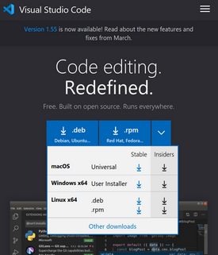
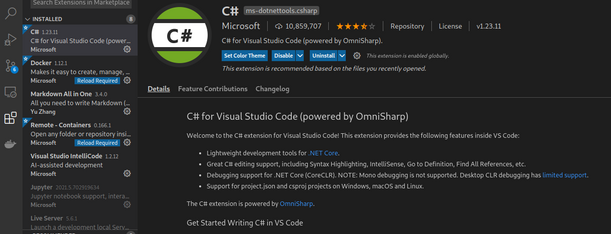
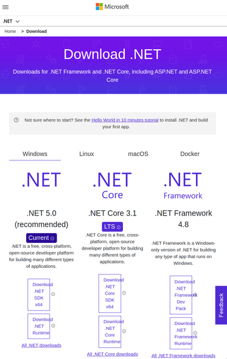
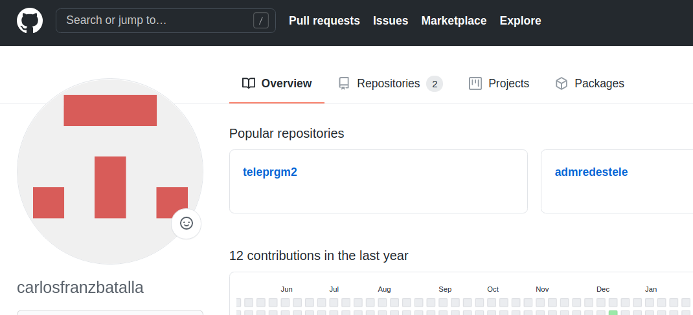
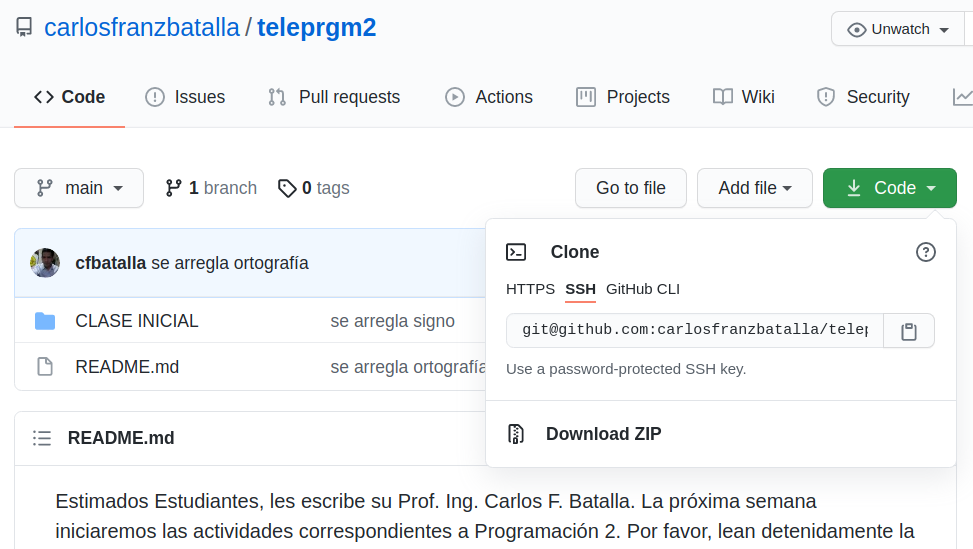
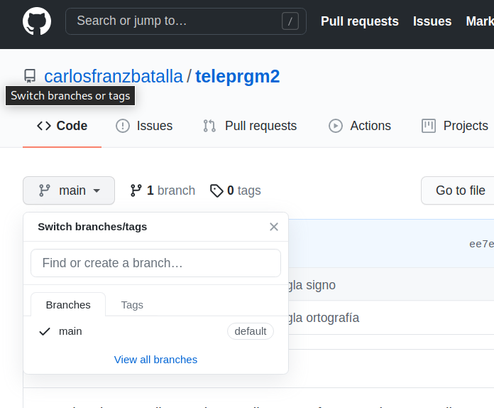
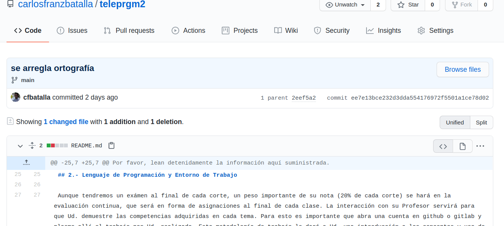

# Configuraciones iniciales
---
## ¿Qué aprenderemos en  esta clase?
- Instalar .NET framework en distintas arquitecturas
- Principios básicos del control de versiones.


---
### 1 Puesta a punto del entorno de trabajo
Aquí instalaremos las herramientas de Desarrollo necesarias para el trabajo en esta asignatura.  
El IDE más ligero que podemos usar para nuestro trabajo con C# es Visual Studio Code (VS Code). Es tan bueno que es multiplataforma o agnóstico de Plataforma (lo puede usar en Windows,Linux o Mac). Además es muy popular, 1er. puesto en la encuesta de [Stack Overflow del 2019](https://insights.stackoverflow.com/survey/2019#development-environments-and-tools). Esto se debe a que, gracias a las extensiones puede usarlo como ambiente de programación de distintos lenguajes con una potencia similar a Visual Studio.
Si tiene un equipo **mediano-a-superior en recursos**, ahórrese estos pasos y no dude en usar [Visual Studio Community](https://visualstudio.microsoft.com/) 2019 o 2017, será alucinante. 

#### 1.1 Instalando el editor - VS Code 
Descargue el instalador correspondiente a su Sistema Operativo desde [aquí](https://code.visualstudio.com/).



Para Windows tendrá un .exe (VSCodeUserSetup-x64-1.55.2.exe) que al ejecutarse exitosamente, instalará VS Code.
Para Linux tiene el instalador .deb (code_1.55.2-1618307277_amd64.deb) para sistemas Debian y para Red Hat y las distribuciones que lo soportan (Fedora, Suse). [Aquí](https://code.visualstudio.com/docs/setup/linux#_rhel-fedora-and-centos-based-distributions) se detallan las instrucciones para instalarlo desde consola.
Si desea instalarlo desde los repositorios, siga las instrucciones a continuación:
##### 1.1.1 Para los que usan Linux (como yo):
En Debian/Ubuntu/Mint
Antes que otra cosa, entre a la consola y actualize los paquetes:
```
sudo apt update
sudo apt install software-properties-common apt-transport-https wget
```
Importe la llave GPG de Microsoft:
```
wget -q https://packages.microsoft.com/keys/microsoft.asc -O- | sudo apt-key add -
```
y habilite el repositorio anteriormente agregado:
```
sudo add-apt-repository "deb [arch=amd64] https://packages.microsoft.com/repos/vscode stable main"
```
Finalmente, instale VS Code:
```
sudo apt update
sudo apt install code
```

#### 1.2 Instalando la extensión 
Inicie VS Code, presione el ícono de Extensiones (barra lateral izquierda) y en la barra de búsqueda tipee "C#"; verá los botones que instalarán la extensión.  



De esta forma, se instalan las demás extensiones que pueda necesitar, incluso la de otros lenguajes que quiera usar. Asi de fácil!.

#### 1.3 Instalando el Framework 
Finalmente, es necesario obtener las herramientas para desarrollar, construir y compilar código C#. Para esto, es necesario instalar .NET SDK, el [framework](https://es.wikipedia.org/wiki/.NET_Core) open source de Microsoft que implementa la infraestructura de lenguaje común ([CLI](https://es.wikipedia.org/wiki/Infraestructura_de_lenguaje_com%C3%BAn))  y su compilador ([CLR](https://es.wikipedia.org/wiki/Common_Language_Runtime)).  
Debe ir al portal del [proyecto .NET](https://dotnet.microsoft.com/download). Escoja .NET 5.0 SDK x64. Análogo a VS Code, la versión para Windows descargará un .exe (dotnet-sdk-5.0.202-win-x64.exe). En Linux lo dirigirá a un instructivo de instalación por consola para cada distribución.



El 2015 Microsoft lanzó la primera versión .NET Core, el proyecto que lograba que el framework .NET fuera multiplataforma.  Desde la versión 5.0 .NET Core y .NET framework es solo .NET. En noviembre de este año será lanzado .NET 6.0 que incorpororá Xamarin para el desarrollo de aplicaciones móviles.

#### 1.4 Llegamos a 'Hola Mundo!' 
Si todos los pasos han sido exitosos, ya puede tener un "Hola Mundo!" en C#. Abra un terminal (cmd, preferiblemente powershell) y dentro de un directorio escriba:

```
dotnet --info
```

Allí le mostrará la información de su SDK y su sistema:

```
.NET SDK (reflecting any global.json):
 Version:   5.0.201
 Commit:    a09bd5c86c

Runtime Environment:
 OS Name:     opensuse-leap
 OS Version:  15.2
 OS Platform: Linux
 RID:         linux-x64
 Base Path:   /usr/share/dotnet/sdk/5.0.201/

Host (useful for support):
  Version: 5.0.4
  Commit:  f27d337295

.NET SDKs installed:
  5.0.201 [/usr/share/dotnet/sdk]

.NET runtimes installed:
  Microsoft.AspNetCore.App 5.0.4 [/usr/share/dotnet/shared/Microsoft.AspNetCore.App]
  Microsoft.NETCore.App 5.0.4 [/usr/share/dotnet/shared/Microsoft.NETCore.App]
```

luego, cree un nuevo proyecto de consola asi:

```
dotnet new console 
```
cuya salida será:

```
Getting ready...
The template "Console Application" was created successfully.

Processing post-creation actions...
Running 'dotnet restore' on /home/carlosfranz/Documents/MyCode/prueba/prueba.csproj...
  Determining projects to restore...
  Restored /home/carlosfranz/Documents/MyCode/prueba/prueba.csproj (in 91 ms).
Restore succeeded.
```

Si listamos los archivo creados tendremos:
```
ls -la
total 20
drwxr-xr-x  3 carlosfranz users 4096 Apr 15 13:41 .
drwxr-xr-x 22 carlosfranz users 4096 Apr 15 13:41 ..
drwxr-xr-x  2 carlosfranz users 4096 Apr 15 13:41 obj
-rw-r--r--  1 carlosfranz users  188 Apr 15 13:41 Program.cs
-rw-r--r--  1 carlosfranz users  171 Apr 15 13:41 prueba.csproj
```
Entonces, tenemos nuestro primer archivo C#, 'Program.cs'. Lo compilamos:

```
dotnet build
Microsoft (R) Build Engine version 16.9.0+57a23d249 for .NET
Copyright (C) Microsoft Corporation. All rights reserved.

  Determining projects to restore...
  All projects are up-to-date for restore.
  prueba -> /home/carlosfranz/Documents/MyCode/prueba/bin/Debug/net5.0/prueba.dll

Build succeeded.
    0 Warning(s)
    0 Error(s)

Time Elapsed 00:00:08.29
```

y lo ejecutamos:

```
dotnet run
Hello World!
```

Puede ver un instructivo similar desde este [enlace](https://channel9.msdn.com/Blogs/dotnet/Get-started-VSCode-Csharp-NET-Core-Windows).

### 2.- Sobre el control de versiones

Los sistemas de Control de Versiones (CVS Control Version System) mantienen un registro de cada cambio aplicado a los archivos de un proyecto. Este registro incluye la fecha y autor del cambio. 
Como la creación de software es un proceso iterativo y colaborativo, el CVS lo protege de errores futuros ejecutados por Ud. y/o sus compañeros de trabajo si sigue el flujo de trabajo siguiente:
1. Cree un proyecto en un directorio de su pc-laptop
2. Notifique al SCM que mantenga el registro de ese directorio
3. Habiendo aplicado cambios en su proyecto, notifique al CVS que mantenga un registro de la versión actual.
4. Si alguna vez necesita retroceder a una version previa y especifica, solicite al CVS que revierta el proyecto a dicha versión.

Team Foundation, Subversion, Mercurial, Git son CVSs ampliamente implementados a lo largo de organizaciones alrededor del Mundo. En esta cátedra usaremos Git a través de GitHub y GitLab, pero antes, revisemos algunos conceptos de los CVS:

- Repositorio: Es el almacén de datos. El respositorio almacena información en forma de un árbol de archivos - una jerarquía típica de archivos y directorios. Un número de clientes se conectan al repositorio, y luego leen o esriben esos archivos. Al escribir datos, el cliente hace que la información esté disponible para los otros; al leer los datos, el cliente recibe información de los demás.
El repositorio lo componen los archivos y directorios de su proyecto, los cambios que se apliquen sobre estos y sus ramas.



- Clonar un repositorio: Para hacer cambios al código Ud. copiará los archivos y directorios del repositorio a su equipo local. Para mantener conexión con su repositorio y subir sus cambios tendrá que Clonar el repositorio en su máquina. En resumen, es su copia local conectada al repositorio (que esta en github)



- Rama: Un repositorio puede tener copias locales en las que Ud. puede trabajar sin tocar el código principal (main), a esto llamamos una rama o 'branch'.  Ud. puede crear y trabajar en una rama de su código y luego consolidarlo con el 'main'.



- Commit: Es una operación en la que Ud. envia sus cambios al repositorio haciendo que estos formen parte del repositorio.



En la medida que vayamos avanzando en los temas, iremos explorando las funcionalidades y ventajas de Git al integrarlo a VS Code, pero si esta muy interesado en este tema puede ir adelantando con [este libro](https://git-scm.com/book/es/v2).

### 3.- Ejercicios y Actividades Propuestas
- 3.1 Cree un nvo. proyecto de consola, cambie "Hello World!" por "Hola Progr2!°. Compile y ejecutelo.

- 3.2 Sobre el control de versiones:
Abra un cuenta en [GitHub](https://github.com/) o [GitLab](https://about.gitlab.com/). De preferencia asociela a la cta. de correo que tiene registrado en Prog. 2.   
Cree un repositorio nuevo, incluya un el resultado de 3.1 y un README.md y escriba alli algunos datos (su nombre y la carrera que estudia).
Envie la url del repositorio al correo de su Profesor.
